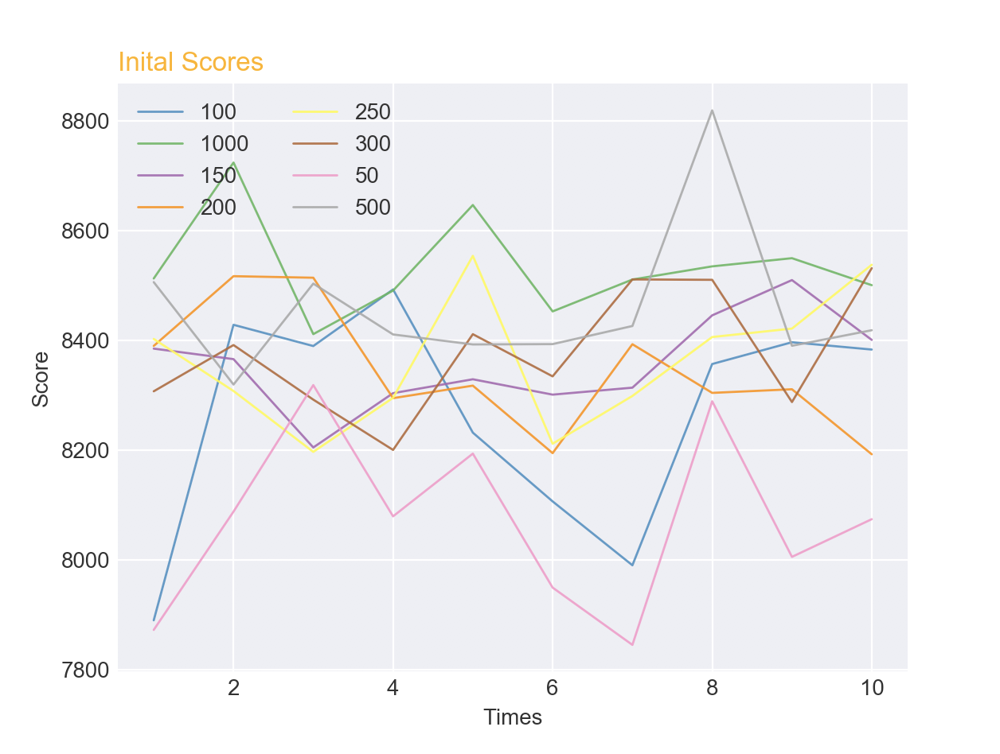
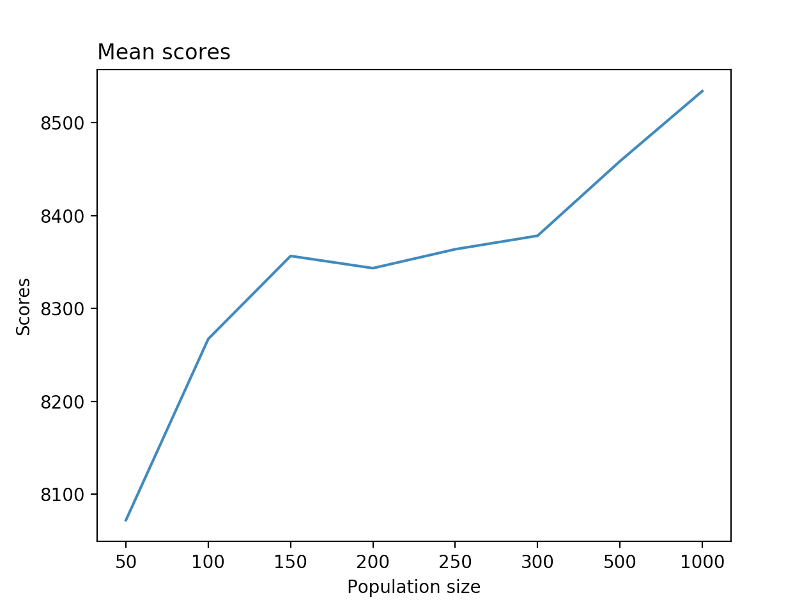
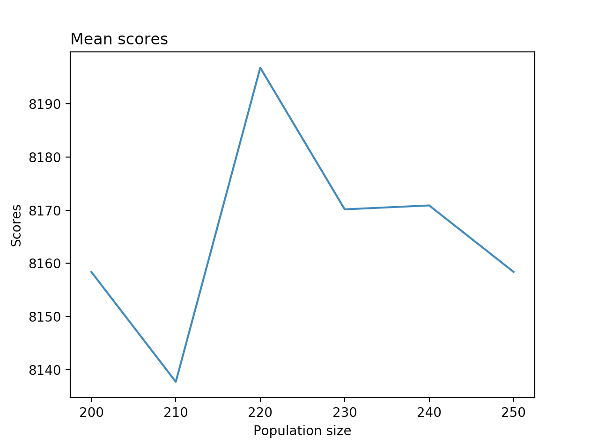
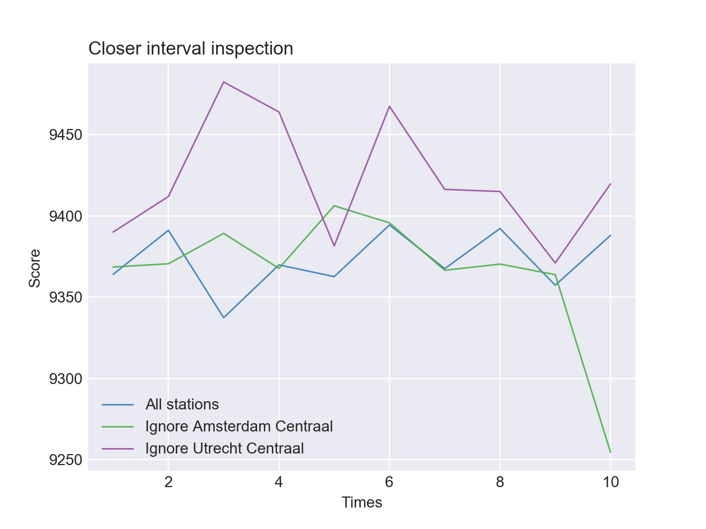
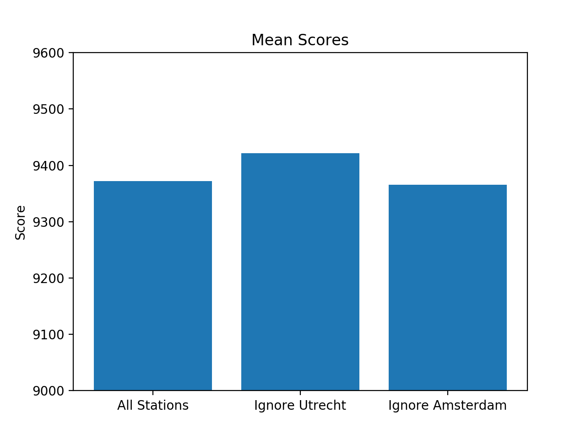

# Experimentation

## Changing the population size of the genetic algorithm

We wondered what effects changing the population size would have on the score. 

We tested this by increasing the population size by 10, and run this 10 times. Then we saved the scores from these 10 times, and calculated the mean score. The mean scores we then plotted in the graph below. 

#### Results
 
We allowed the maximum amount of generations to 20. This because the algorithm is quite time consuming. 

The above graph shows a few interesting things. Firstly, because the scores are randomly generated, an increased population size means that the random algorithm is run more times, so the chance of a better score increases. This is why the scores of population size 1000 are higher than the rest. This is especially visible in the plot below. 

A population size of 1000, however, is a bit unrealistic: the runtime for this far outweighs the gain. 

Another interesting observation about this graph is that the scores of population size 200 and 250 are pretty decent. This might just be luck, because once again the population is randomly generated, but there might be something here. To investigate this further we decided to take a closer look at the interval between 200 and 250. We ran the genetic algorithm, increased the population size from 200 to 250 with steps of ten, and ran the algorithm ten times for each population size.  

The results are shown in the plot below. 

The above plot shows that a population size of 220 shows the best results.

#### Conclusion

The above results show that the bigger the population size, the better the results. This is because the initial population is randomly generated, and the more times you run the random algorithm, the higher the chance of finding a good solution with a high score. 
A population size of 1000 is however quite unreasonable, as this takes up a lot of runtime, while the gain is minimal. Inspection of the interval population size 200-250 showed that a population size of 220 appears to be a good compromise. However, these results should be taken with a grain of salt as, once again, the solutions are random and these resuls may thus be a case of luck. 

## Removing a station

We wondered what would happen if we removed an important station, say, Utrecht Centraal. We were interested in how high we could get the score if we removed Utrecht Centraal and Amsterdam Centraal.

We first needed to get a base measurement. We ran the hillclimber algorithm 10 times in its  standard configuration to retrieve a base. 

Then we set out to remove Utrecht Centraal. We once again ran the hillclimber in its standard configuration, but this time we set out to ignore Utrecht Centraal. 

#### Results 

Ignoring Utrecht Centraal returned a score that was actually better than our base score. 
Ignoring Amsterdam Centraal didn't raise the score by much. 

The results are shown in the graph below. 

The means of the scores are portrayed below. 

#### Conclusion

Ignoring Utrecht Centraal seems to generate a higher score. We think this caused by the fact that Utrecht is a central point, so it has lots of critical connections. Eliminating Utrecht Centraal from the equation causes there to be less critical connections, and thus less chance of missing a critical connection. 

Amsterdam Centraal is less important, and thus causes a lesser increase in the score. 

## Some tests to the improvementrate of the hillclimbers route iterations.

For the most difficult case, where all intercity stations in Netherland are concidered critical, our hillclimber with route iterations seemed to do very well. Thus it seemed very interesting to have a closer look on the avarage score it produces, and how fast it improves. In order to test this we ran 100 hillclimbers with 10000 route iterations and randomly generated input solutios. The results were promising, but the algorithm was still gaining score at a decent rate, so we ran the algorithm 20 more times, but now with 50000 iterations and random input.

### Results

The 20 runs with 50k iterations gave us a mean score just below 9400. The algorithm barely gained any points anymore,

## Acknowledgements

Spaghetti plots were created with the help of [python-graph-gallery.com](https://python-graph-gallery.com/124-spaghetti-plot/).
